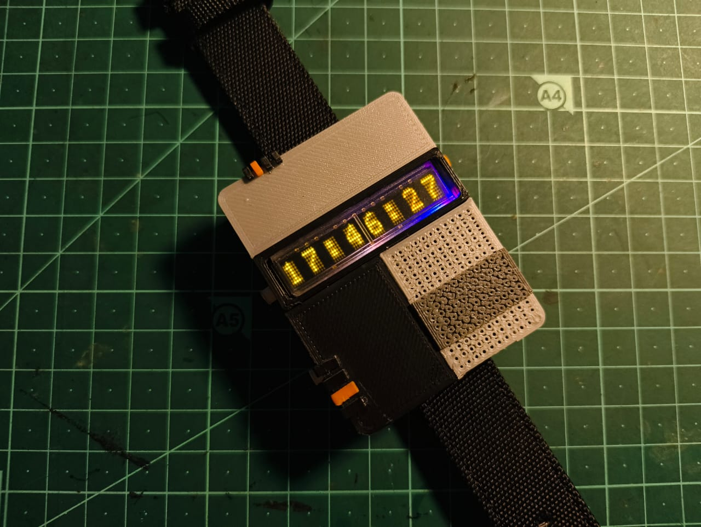
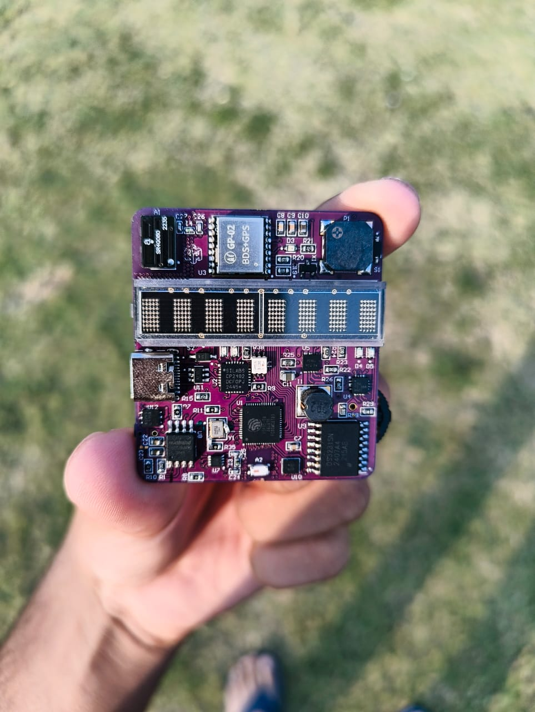
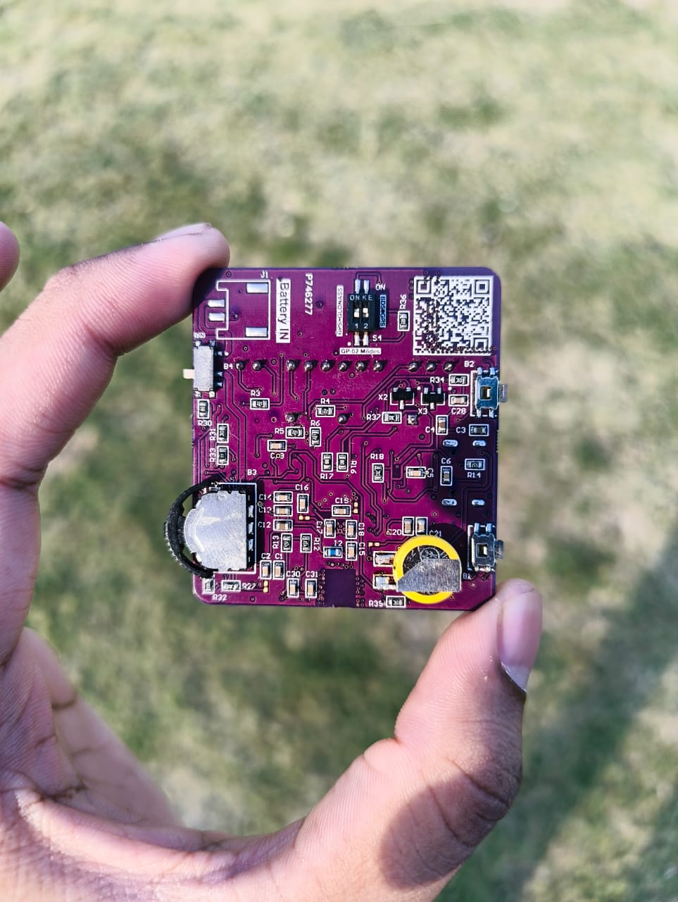
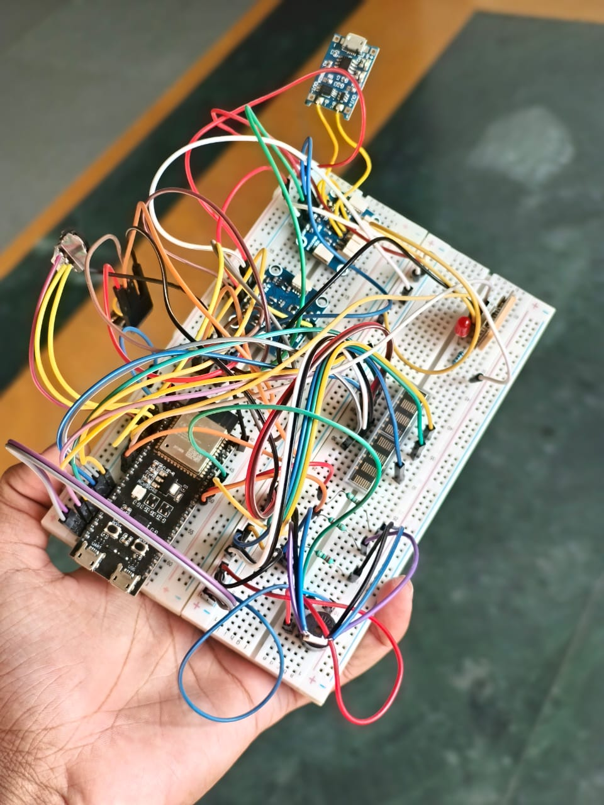

# H-CUBE-Smartwatch
A custom retro-style smartwatch powered by ESP32-S3 and HCMS-2971 LED display. Open-source hardware and firmware.

# H-CUBE: Retro-Style ESP32-S3 Smartwatch


**H-CUBE** ("Hardware Cube") is a fully custom, open-source smartwatch project that blends 80s retro aesthetics with modern IoT capabilities. Powered by the **ESP32-S3** and featuring a vintage **HCMS-2971** alphanumeric LED display, this wearable serves as a compact development platform for embedded systems, integrating GPS, motion sensing, and power management into a 3D-printed enclosure.

---

## 📸 Gallery

<!-- Upload images to an 'images' folder in your repo and uncomment the lines below -->





---

## 🚀 Features

### Hardware
*   **Core:** ESP32-S3 (Dual-core 240 MHz, WiFi + BLE 5.0).
*   **Display:** HCMS-2971 8-Character Yellow Alphanumeric LED (Vintage aesthetic, ~2000 nits brightness).
*   **Sensors:**
    *   **IMU:** BMI270 (6-axis accelerometer/gyroscope) for motion detection and wake-on-raise.
    *   **GPS:** GP-02 GNSS module for location tracking and time sync.
    *   **RTC:** DS3231 Precision Real-Time Clock for accurate timekeeping during sleep.
*   **Power:**
    *   **Charger:** BQ24075 with power path management.
    *   **Fuel Gauge:** MAX17048 for precise battery percentage monitoring.
    *   **Runtime:** 8-12 hours active use, with intelligent deep-sleep (10s timeout).
*   **User Interface:** 3-way navigation switch, RGB LED indicators, and Piezo Buzzer.

### Firmware & Software
*   **12 Operational Modes:** Time, Date, GPS Info, Temperature, Alarm, Stopwatch, Timer, RGB Control, Battery Status, Settings, etc.
*   **Connectivity:** Bluetooth SPP (Serial Port Profile) for phone pairing and WiFi for NTP time sync.
*   **OTA Updates:** Supports Over-The-Air firmware flashing.
*   **Power Saving:** Optimized sleep routines using the ESP32 ULP (Ultra Low Power) co-processor features.

---

## 🛠️ Tech Stack & Tools

*   **PCB Design:** Altium Designer (4-Layer Stackup, Impedance Controlled).
*   **CAD/Enclosure:** Autodesk Fusion 360 (Housing), KeyShot/Rhino (Rendering).
*   **Firmware:** C/C++ (Arduino IDE / PlatformIO).
*   **Fabrication:** 3D Printing (SLA/FDM for enclosure), Hot-plate Reflow (SMD Assembly).

---
---

## ⚡ Getting Started

### 1. Prerequisites
*   **Hardware:** H-CUBE PCB (assembled), LiPo Battery (3.7V), FTDI programmer (if not using USB-native boot).
*   **Software:** Arduino IDE (v2.0+) or PlatformIO.

### 2. Firmware Installation
1.  Clone this repository:
    ```
    git clone https://github.com/AshuDas503/H-CUBE.git
    ```
2.  Open the project in **Arduino IDE**.
3.  Install required libraries via Library Manager:
    *   `Adafruit_NeoPixel`
    *   `RTClib` (Adafruit)
    *   `SparkFun_BMI270_Arduino_Library`
    *   `TinyGPSPlus`
    *   *Note: Check `firmware/library_list.txt` for specific versions.*
4.  Select Board: **ESP32S3 Dev Module**.
    *   *USB CDC On Boot:* Enabled
    *   *Flash Size:* 8MB (or matches your specific IC)
5.  Connect the H-CUBE via USB and click **Upload**.

### 3. Assembly
*   Refer to the `Enclosure/README.md` for 3D printing settings (Layer height: 0.12mm recommended).
*   Wiring diagrams and pinout maps can be found in `Hardware/schematics/`.

---

## 🎮 Controls

*   **Center Click:** Wake / Enter Menu / Select.
*   **Up/Down:** Navigation / Value Adjustment.
*   **Long Press (Center):** Power Off / Sleep.

---

## 🤝 Contributing

Contributions are welcome!
1.  Fork the Project
2.  Create your Feature Branch (`git checkout -b feature/AmazingFeature`)
3.  Commit your Changes (`git commit -m 'Add some AmazingFeature'`)
4.  Push to the Branch (`git push origin feature/AmazingFeature`)
5.  Open a Pull Request

---

## 📜 License

This project is licensed under the MIT License - see the [LICENSE](LICENSE) file for details.

---

## 🔗 References & Links

*   **Instructables Guide:** [https://www.instructables.com/H-CUBE-a-Retro-Style-Smart-Watch-Powered-by-an-ESP/]
*   **Video Demo:** [https://www.youtube.com/watch?v=HaJIaakPBnE&t=3s]

---

*Created by **Ashutosh Dash**.*


